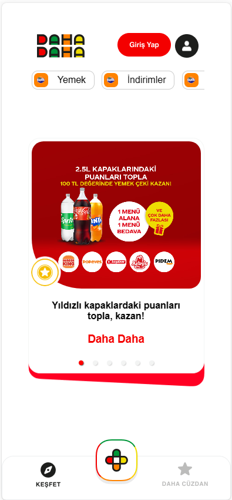
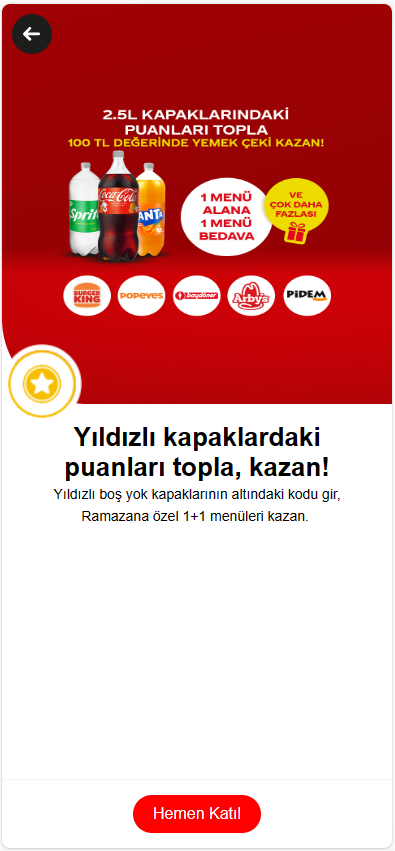

# Kaizen Case Study

Bu proje, React.js ve TypeScript Kullanılarak geliştirilmiştir.React-router-dom kullanılarak 2 sayfalı bir web uygulaması geliştirilmiştir.

## Başlangıç

Projeyi yerel ortamınızda çalıştırmak için aşağıdaki adımları takip edin.

### Gereksinimler

Projeyi çalıştırmak için bilgisayarınızda [Node.js](https://nodejs.org/) ve [npm](https://www.npmjs.com/) yüklü olmalıdır.

### Kurulum

1. Repoyu bilgisayarınıza klonlayın.

   ```bash
   git clone https://github.com/mervAyz/case-study.git

2. Proje dizinine gidin.

    ```bash
    cd case-study
   
3. Bağımlılıkları yükleyin.

    ```bash
    npm install

### Çalıştırma
Proje bağımlılıkları yükledikten sonra aşağıdaki komutla uygulamayı başlatabilirsiniz

    npm start

Tarayıcınızda http://localhost:3000 adresine giderek uygulamayı görebilirsiniz.

### Kullanılan Teknolojiler
- React.js ("^18.2.0")
- TypeScript
- Postman
- npm 
- React-router-dom
- React-responsive-carousel
- Axios

### Uygulama ekran görüntüleri




